## 5.1P: Containerisation using Docker

**Overview**

This project explains how to containerise a basic Node.js web application using Docker. It covers the full process: writing a `Dockerfile`, setting up `docker-compose.yml`, building and testing the Docker image locally, and pushing it to Docker Hub for sharing. The goal is to learn how Docker can simplify app setup, make deployment easier, and ensure the app works the same on any system.

**Key concepts:**

Docker — a tool that helps your apps run _anywhere_ without breaking.

- **dockerfile →** a blueprint for building a docker image → blueprint
- **image** is a template for running docker container → template
- **container** is just running process → running app

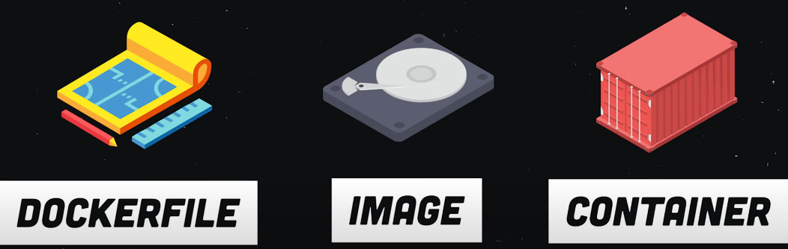

https://www.youtube.com/watch?v=gAkwW2tuIqE&list=TLPQMjMwMzIwMjUWajQHhNC7sA&index=1&pp=gAQBiAQB

**Tools used:**

- Git: [https://github.com](https://github.com/)
- Visual Studio Code: [https://code.visualstudio.com](https://code.visualstudio.com/)
- Node.js: https://nodejs.org/en/download/
- Docker: https://www.docker.com/

**Instructions**

1. Install Docker
2. Create a New App using Node.js
3. **Create a `Dockerfile`** to package the app
4. Build the Docker image
5. Create a Docker compose file (`docker-compose.yml`)
6. Start the Docker Compose environment
7. Test the application
8. Push the Docker image to a registry

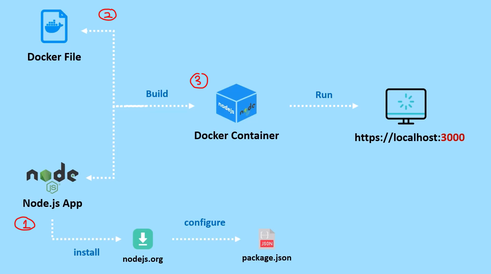

- demonstrate steps diagram

---

<aside>

**Note:** If want to continue project, you need to open `docker desktop`app, and so that it able to run `compose-docker run`

</aside>

### **Step 1: Install Docker**

- Download Docker Desktop from https://www.docker.com/products/docker-desktop/
- Follow the install guide for your OS (Windows/Mac/Linux)
- After install, test it works:

```bash
docker --version
```

---

### **Step 2: Create a New App (Simple Node.js Web App)**

1. Create a new project folder:

```bash
mkdir my-docker-app
cd my-docker-app
```

2. Initialise a basic Node app:

```bash
npm init -y
```

3. Create `server.js`:

In the same folder, create a new file called `server.js` with this content:

```jsx
const express = require("express");
const app = express();
const PORT = 3000;

app.get("/", (req, res) => {
  res.send("Hello from Dockerised App!");
});

app.listen(PORT, () => {
  console.log(`Server is running on http://localhost:${PORT}`);
});
```

4. Install Express:

```bash
npm install express
```

Once that’s done, your folder will look like this:

```
my-docker-app/
├── node_modules/
├── package.json
├── package-lock.json
└── server.js

```

---

### **Step 3: Create a `Dockerfile`**

- In your project folder, create a file called `Dockerfile` (no extension).
- Example for a basic Node.js app:

  ```bash
  FROM node:18     # Node.js version 18

  WORKDIR /app     # Set working folder inside the container to /app

  COPY . .         # copy everything from your current project folder into the container

  RUN npm install  # Install all dependecncies

  EXPOSE 3000      # Open port 3000, so you can see the app in your browser

  CMD ["npm", "start"]  # Tells Docker to start the app when the container runs
  ```

---

### **Step 4: Build the Docker Image**

- In terminal, inside the app folder:

  ```bash
  docker build -t my-web-app .
  ```

  - **`docker build`** = Create Docker image
  - **`-t my-web-app`** = Tags (names) the image as `my-web-app`
  - **`.`** = build from the `Dockerfile` in the current folder

- To check docker images - like check file lists
  ```bash
  docker images
  ```

---

### **Step 5: Create a Docker compose file (`docker-compose.yml`)**

- In the same folder, create a file named `docker-compose.yml`:
  ```yaml
  version: "3" # Docker compose file format version
  services:
    web:
      build: .
      ports:
        - "3000:3000" # Maps port 3000 on your machine to port 3000 in the container
  ```

---

### **Step 6: Start Docker Compose**

- Run this command:
  ```bash
  docker-compose up
  ```
- Your app should now run on [http://localhost:3000](http://localhost:3000/)

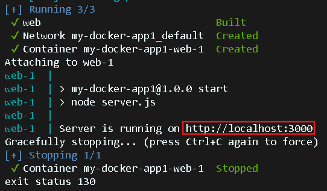

---

### **Step 7: Test the Application**

- Open a browser and go to [http://localhost:3000](http://localhost:3000/)
- Check if your app works properly.

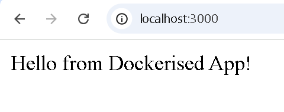

---

### Step 8: Push Docker Image to Docker Hub

1. **Sign in or Sign up at** [hub.docker.com](https://hub.docker.com/)

2. **Create a New Repository**

- Click **"Create a Repository"**

  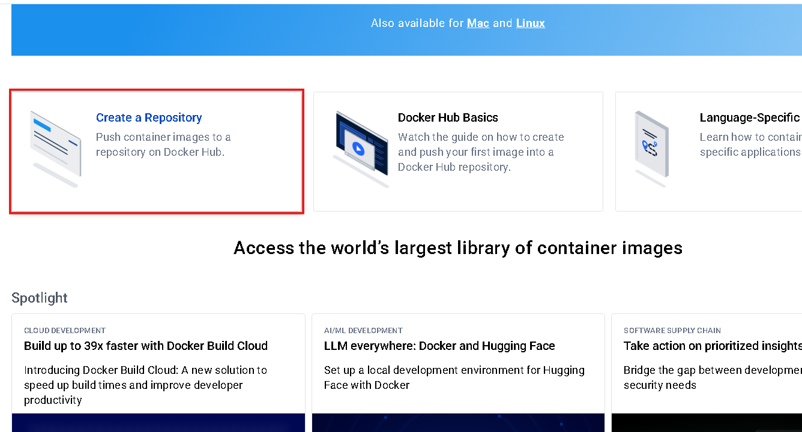

  - **Docker Hub** is a website to store and share your Docker images.

- **Repository name**: `myapp-docker-push-example` (or your own)
- **Description**: `My simple app using Docker`
- Set to **Public**
- Click **"Create"**

  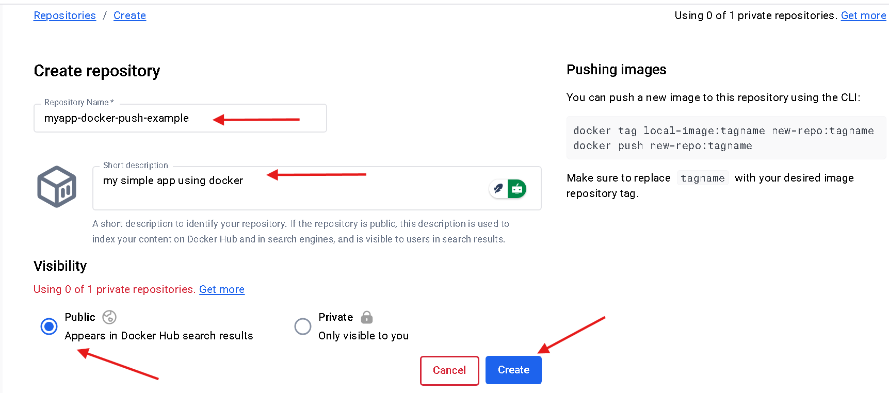

- The Docker repository has been created and is now ready to receive pushed images from the local build
  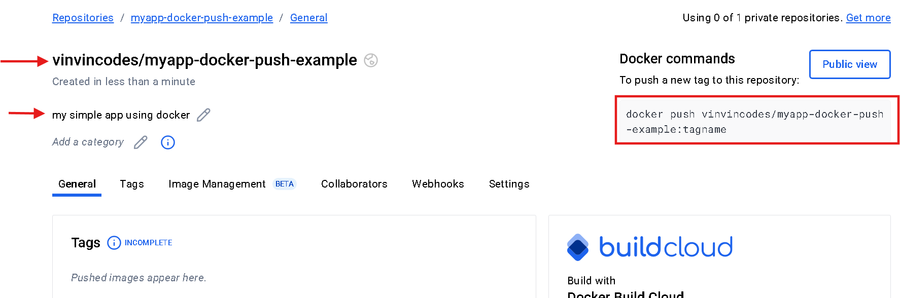

3. **Generate a Personal Access Token**

- Go to **Profile > Account Settings > Personal Access Tokens**
- Click **Generate new token**
- Fill in:
  - **Description**: `demo1`
  - **Expiration**: e.g., 30 days
  - **Access**: `Read & Write`
- Click **Generate** → Save the token securely
- It gives you token. It show like this.
    <aside>
    
    1. run
        
        ```bash
        docker login -u <your-username>
        ```
        
    2. 2. At the password prompt, enter the personal access token.
        
        ```bash
        <token-password>
        ```
        
    </aside>

4. **Log in from Terminal**

```bash
docker login -u <your-dockerhub-username>
```

- When prompted for password, paste your **access token**
- You should see: `Login Succeeded`

5. **Tag and Build Your Image**

```bash
docker build -t <your-docker-username>/myapp-docker-push-example .
```

> Replace <your-docker-username> with your actual Docker Hub username

6. **Check Built Image**

```bash
docker images
```

- Confirm the image is listed under the right name and tag

  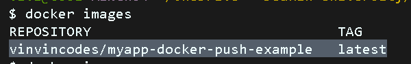

7. **Push the Image**

```bash
docker push <your-docker-username>/myapp-docker-push-example
```

- Notes:
  - push = uploads your image to Docker Hub;
  - pull = downloads and run it on any machine.

8. **Verify on Docker Hub**

- Go to your repo page
- Check the **Tags** tab → You should see `latest`
  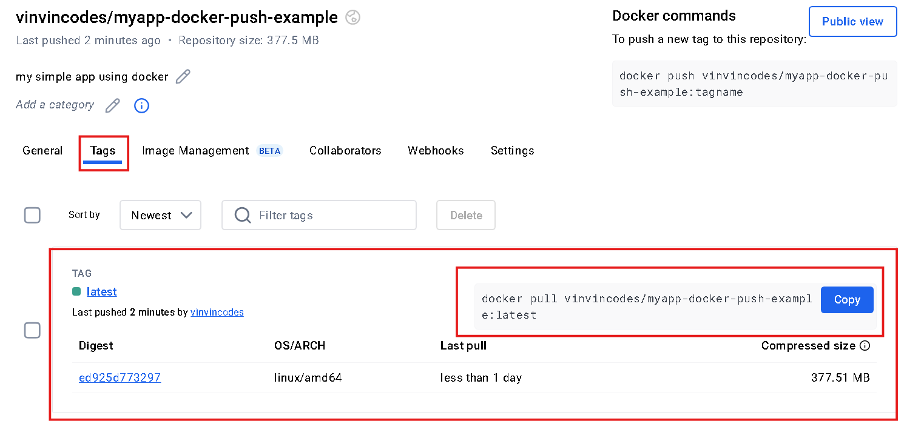
- Copy the `docker pull` command if needed

**(Optional Cleanup)**

1. Delete Docker Repository:

- Go to your repo → Settings → Scroll down → Click **Delete repository**

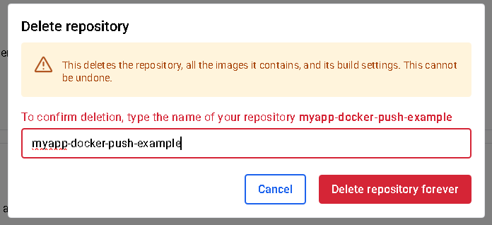

1. Delete Personal Access Token:

- Go to **Account settings > Personal Access Tokens**
- Click the **3 dots** next to the token → **Delete**

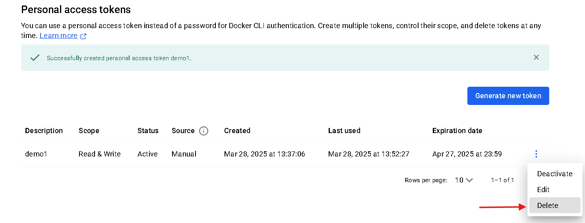
